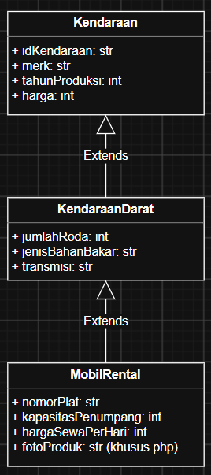
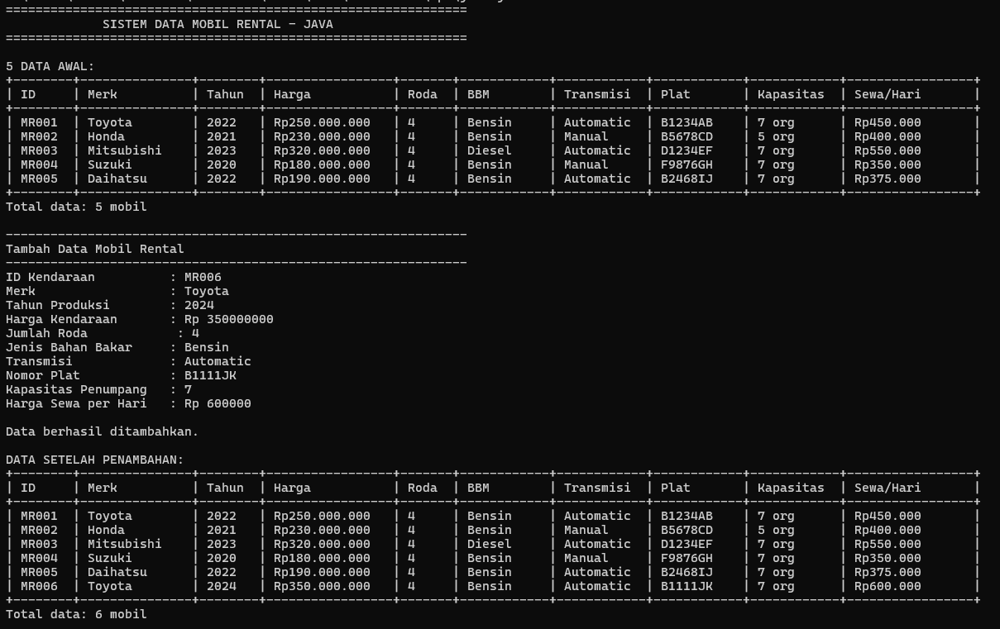
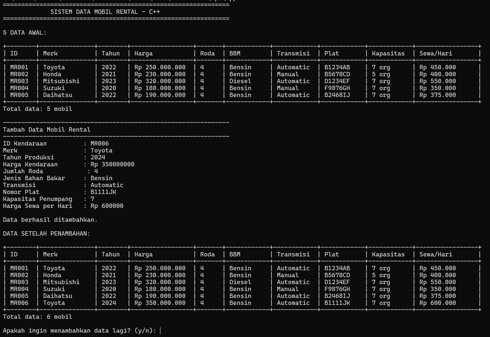
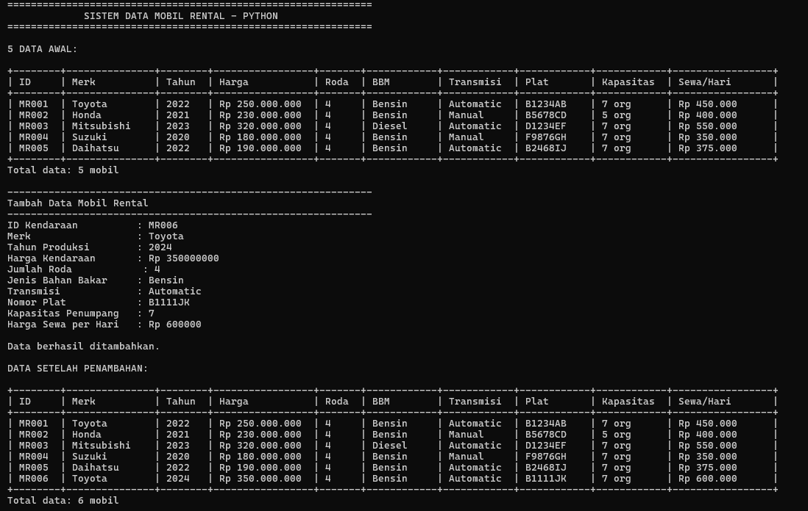
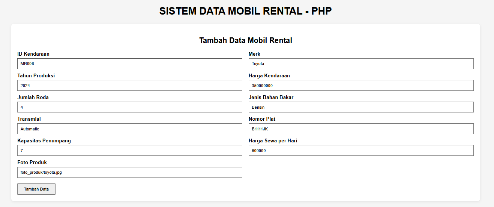
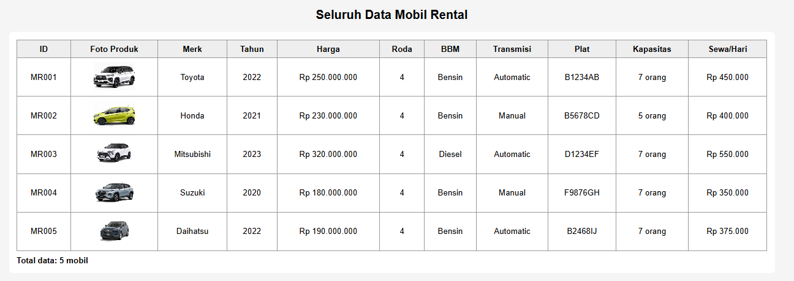
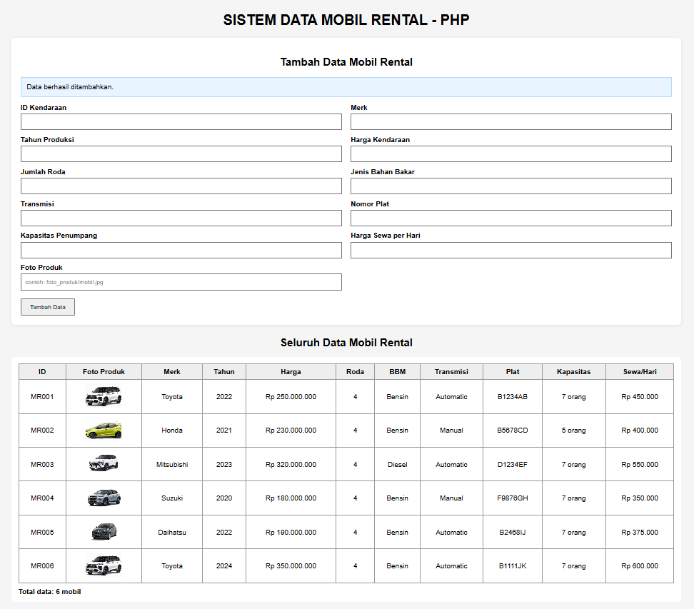

# Janji

Saya Novelio Yeheskiel Kapahang dengan NIM 2503048 mengerjakan TP 2 dalam mata kuliah Desain Dan Pemrograman Berorientasi Objek untuk keberkahanNya maka saya tidak melakukan kecurangan seperti yang telah dispesifikasikan. Aamiin

# Sistem Data Mobil Rental

Program ini dibuat dalam empat bahasa, yaitu Java, C++, Python, dan PHP. Program digunakan untuk menyimpan dan menampilkan data mobil rental.

## 1. Atribut dan Method

### Kendaraan

**Atribut:**

* `idKendaraan` : ID kendaraan
* `merk` : merk kendaraan
* `tahunProduksi` : tahun kendaraan dibuat
* `harga` : harga kendaraan

**Method:**

* `Kendaraan()` : constructor untuk mengisi data kendaraan
* `hitungNilaiDepresiasi()` : menghitung nilai penyusutan kendaraan
* `tampilkanInfo()` : menampilkan informasi kendaraan

### KendaraanDarat

**Atribut:**

* `jumlahRoda` : jumlah roda kendaraan
* `jenisBahanBakar` : jenis bahan bakar
* `transmisi` : jenis transmisi

**Method:**

* `KendaraanDarat()` : constructor untuk mengisi data kendaraan darat
* `cekKelayakanBerkendara()` : mengecek kelayakan kendaraan
* `tampilkanInfo()` : menampilkan informasi kendaraan darat

### MobilRental

**Atribut:**

* `nomorPlat` : nomor plat mobil
* `kapasitasPenumpang` : jumlah maksimal penumpang
* `hargaSewaPerHari` : harga sewa mobil per hari
* `fotoProduk` : foto mobil (khusus PHP)

**Method:**

* `MobilRental()` : constructor untuk mengisi data mobil rental
* `hitungBiayaSewa()` : menghitung total biaya sewa
* `tampilkanDetailRental()` : menampilkan detail mobil rental

## 2. Diagram

Relasi antar kelas:

`Kendaraan → KendaraanDarat → MobilRental`

MobilRental merupakan turunan dari KendaraanDarat, sedangkan KendaraanDarat merupakan turunan dari Kendaraan.

## 3. Alur Program

### Java, C++, dan Python

1. Program dimulai.
2. Program membuat 5 data mobil rental awal.
3. Data awal ditampilkan dalam bentuk tabel.
4. Pengguna memasukkan data mobil baru.
5. Program melakukan validasi input.
6. Jika data valid, objek `MobilRental` baru dibuat dan dimasukkan ke dalam daftar.
7. Data terbaru ditampilkan.
8. Program menanyakan apakah pengguna ingin menambahkan data lagi.
9. Jika `y/ya`, proses kembali ke input data.
10. Jika `n/tidak`, program selesai.

### PHP

1. Pengguna membuka halaman `index.php`.
2. Program memuat class `Kendaraan`, `KendaraanDarat`, dan `MobilRental`.
3. Program membuat 5 data mobil rental awal.
4. Data ditampilkan dalam tabel dan form input.
5. Pengguna mengisi form dan menekan tombol tambah data.
6. Program mengambil dan memvalidasi data dari form.
7. Jika data valid, objek `MobilRental` baru dibuat dan ditambahkan ke daftar.
8. Data terbaru ditampilkan kembali dalam tabel.
9. Jika data tidak valid, program menampilkan pesan kesalahan.

Data pada PHP tidak disimpan ke database, sehingga ketika halaman dimuat ulang, data kembali ke 5 data awal.

# Dokumentasi

## 1. Java

## 2. CPP

## 3. Python

## 4. PHP

